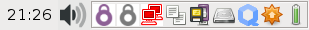
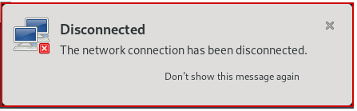
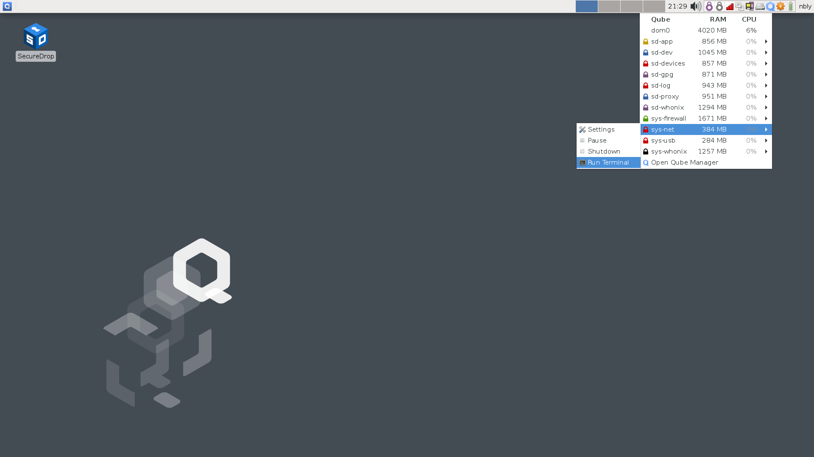
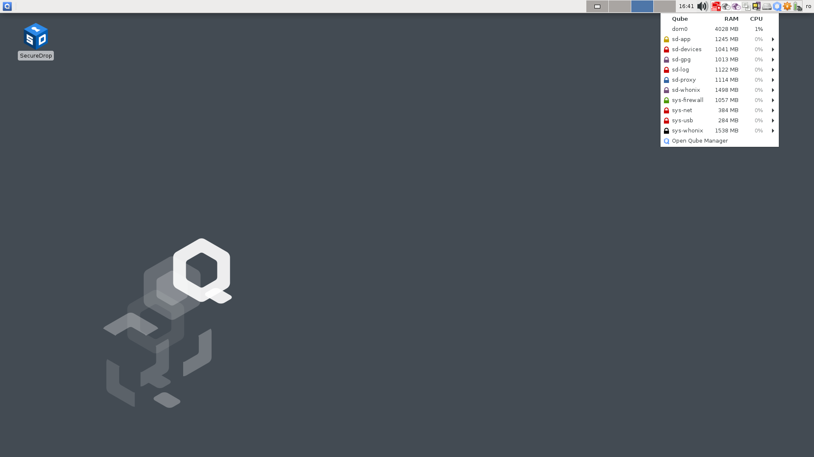
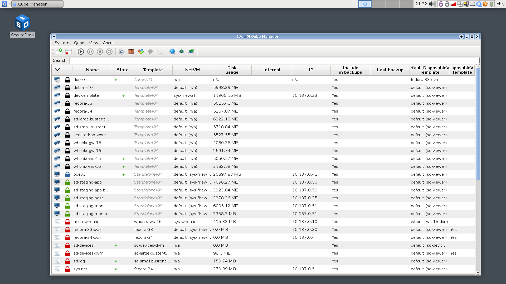
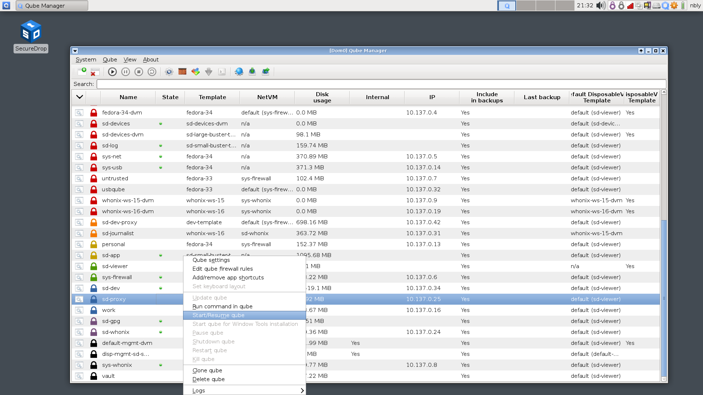

Troubleshooting connection problems
===================================

Before troubleshooting connection problems, we recommend reading about the
:ref:`networking architecture <Networking Architecture>`
of SecureDrop Workstation. If you are in a hurry, this guide offers quick
diagnostic and remedial steps.

Step 1: Verify you are connected to the Internet
~~~~~~~~~~~~~~~~~~~~~~~~~~~~~~~~~~~~~~~~~~~~~~~~

You can use both wireless and wired networks in Qubes. You can manage network
access through the network manager, which you can find in the area populated
with icons in the top right corner of your Qubes desktop, known as the *system
tray*.

The network manager is the red icon, which looks like this for a wired connection
(ordering of icons may vary):

|screenshot_network_manager_wired_icon|

It looks like this for a wireless connection:

|screenshot_network_manager_wireless_icon|

It looks like this when you are not connected to the Internet at all:

|screenshot_network_manager_no_internet_connection|

When a network connection is lost, Qubes will display an alert like the
following:

|screenshot_network_manager_lost_connection_notification|

Common causes for lost connections include fully or partly unplugged network cables,
lost power to networking equipment, and ISP service outages. When you see a lost
connection notification, it is most likely due to one of these causes.

.. important::

   Not all VMs in Qubes OS have Internet access. For example, opening a terminal via
   |qubes_menu| **▸ Gear Icon (left-hand side) ▸ Other Tools ▸ Xfce Terminal** opens a ``dom0``
   terminal without Internet access. See our :ref:`networking architecture <Networking Architecture>`
   overview for additional background.

If the network manager shows that you are connected to the Internet, you can
verify whether your connection is working by opening a terminal in ``sys-net``:

|screenshot_q_widget_sysnet_run_terminal|

1. Click the Qubes Domains menu |blue_qube| in the in the system tray (top right area).
2. A list of running VMs should appear. Select ``sys-net`` from the list, and
   click **Run Terminal**.
3. In the terminal window, type the command ``ping -c 5 google.com``.

You should see a sequence of lines starting with ``64 bytes from`` and ending with
the number of milliseconds it took to complete the request. If you do not see
similar output, your network access may be misconfigured, or the Internet may be
wholly or partially unreachable. If using ``8.8.8.8`` instead of ``google.com``
works, it may suggest a problem at the DNS level in your network configuration.

If you have verified that you are able to connect to the Internet using
``sys-net``, but you are experiencing other connectivity issues, move on to the
next step.

Step 2: Troubleshooting login issues
~~~~~~~~~~~~~~~~~~~~~~~~~~~~~~~~~~~~
Issues logging in may not be network-related. If you are experiencing
connectivity issues before or after logging in, you can skip ahead to the next section.

Make sure that your username, passphrase, and two-factor code are correct.

.. important::

   After a failed login, wait for a new two-factor code from your app before
   trying again.

You can reveal the passphrase by clicking the "eye" icon next to it in the login
dialog (ensure you are in a fully private setting before doing so). Check for
extra characters and end, or subtle differences like capitalization. Note that
the spaces between words in SecureDrop passphrases are part of the passphrase.

If you use the two-factor app on your phone for other websites and services,
make sure that you have selected the correct user account. It should be labeled
**SecureDrop**.

If you have access to a Tails-based *Journalist Workstation*, verify whether you
can access SecureDrop from Tails.

If you are certain that your credentials are correct but you are unable to log
in, proceed to the next step.

Step 3: Verify that all required VMs are running
~~~~~~~~~~~~~~~~~~~~~~~~~~~~~~~~~~~~~~~~~~~~~~~~
The following VMs must be running for all actions requiring network connectivity
to work (e.g., logging in, checking for messages, downloading documents, replying
to sources, starring sources, deleting sources):

- ``sd-app``
- ``sd-gpg``
- ``sd-log``
- ``sd-proxy``
- ``sys-firewall``
- ``sys-net``
- ``sys-whonix`` (during updates)

You can verify whether a VM is running or not by clicking the |blue_qube| icon in the
system tray (top right). Only VMs that are currently running will appear in the
list:

|screenshot_q_widget_vm_list|

If a required VM is not running, you can launch it from the Qube Manager. Open
the Qube Manager by clicking **Open Qube Manager** in the menu above. A window
like the following should appear:

|screenshot_qube_manager|

To start a VM, select it from the list, right-click it, and click **Start/Resume
Qube**. Alternatively, you can click the "Play" button in the toolbar.

|screenshot_start_resume_qube|

In ordinary use, VMs required by SecureDrop should be started on boot or when
they are needed. If you repeatedly experience problems with a necessary VM not
running, or if an error message is displayed when attempting to start the VM,
please contact us for assistance.

If all required VMs are running, proceed to the next step.

Step 4: Verify that required VMs have connectivity
~~~~~~~~~~~~~~~~~~~~~~~~~~~~~~~~~~~~~~~~~~~~~~~~~~
In step 1, you have already verified that you can connect to the
Internet using ``sys-net``. Now, test whether ``sys-firewall`` and ``sd-proxy`` are working.

First, open a terminal in ``sys-firewall`` and run the ``ping google.com`` command.
You should see similar output as in ``sys-net`` before.

Now, open a terminal in ``sd-proxy`` and run the following command:

``curl -s --proxy socks5h://localhost:9150 https://check.torproject.org | grep Congratulations``

This command contacts a service intended for web browsers to verify whether your
Tor connection is working.

You should see the text "Congratulations. This browser is configured to use Tor."
or a similar message on the terminal.

If the output does not include the text "Congratulations", proceed to the next steps.

Step 5: Restart ``sd-proxy``
~~~~~~~~~~~~~~~~~~~~~~~~~~~~~~~~~~~~~~~~~~~~~~
Restart ``sd-proxy`` to attempt to restore connectivity:

1. Exit the SecureDrop app if it is running.
2. Click the Qubes Application menu |qubes_menu| icon in the system tray (top left).
3. Click **Run Qube Manager**
4. Right-click ``sd-proxy`` in the list of VMs. Click **Shutdown qube**.
5. Right-click ``sd-proxy`` in the list of VMs. Click **Start/Resume qube**.

If this does not resolve the issue, proceed to the next step.

Step 7: Restart ``sys-net`` and ``sys-firewall``
~~~~~~~~~~~~~~~~~~~~~~~~~~~~~~~~~~~~~~~~~~~~~~~~

.. note::

   You will temporarily lose all Internet connectivity in Qubes OS during this
   step.

Using the same procedure as in the previous step, shut down ``sd-proxy``. Attempt to shut down
``sys-firewall``. You may see an error message telling you that other VMs still
require access to ``sys-firewall``. Save your work in those VMs, shut them
down, and attempt to shut down ``sys-firewall`` again.

Finally, shut down ``sys-net``. The network manager icon should disappear.

Now, start ``sys-proxy``, which will bring up ``sys-net`` and ``sys-firewall``
at the same time.

If this does not resolve the issue, please contact us for assistance.

Customizing Synchronization Timeouts
~~~~~~~~~~~~~~~~~~~~~~~~~~~~~~~~~~~~

The SecureDrop Workstation Client application performs a synchronization on
launch, which may time out in situations where there are a large number of 
sources on the server. To the extent possible, we recommend regularly removing
sources that are no longer actively engaging with you, or any sources that
appear to be spam.

If you are able to login to the Client application, but sources are not
appearing, you may be reaching a timeout for the synchronization process.
To temporarily increase the timeout, and give the system more time to
finish synchronizing with the server, you can perform the following steps:

1. Log into the Qubes workstation
2. Start a system Terminal in ``dom0`` via |qubes_menu| **▸ Gear Icon (left-hand side) ▸ Other Tools ▸ Xfce Terminal**
3. Run the following commands::
   
       qvm-service --enable sd-app SDEXTENDEDTIMEOUT_600
       qvm-shutdown sd-app && sleep 5 && qvm-start sd-app
   
4. Start the SecureDrop Client application, like normal

These instructions will change the sync timeout to 10 minutes. If the sync
fails to complete in that time, repeat the instructions, replacing the "600"
with a larger value. We recommend increasing the number in increments
of 100, and checking after each change to find the best value.

Once the synchronization has completed and the sources have loaded, we advise
going through and removing any unnecessary sources.

Examining logs
~~~~~~~~~~~~~~
You may wish to examine system logs on your own, or with our guidance. You can
examine consolidated syslogs from all SecureDrop-related VMs in the ``sd-log``
VM. They can be found in the default user's ``~/QubesIncomingLogs`` directory.

In addition, you may want to examine ``/var/log/syslog`` in ``sys-net`` and
``sys-firewall``.

.. |screenshot_network_manager_no_internet_connection| image:: ../../images/screenshot_network_manager_no_internet_connection.png
  :width: 100%

.. |blue_qube| image:: ../../images/blue_qube.png
.. |qubes_menu| image:: ../../images/qubes_menu.png