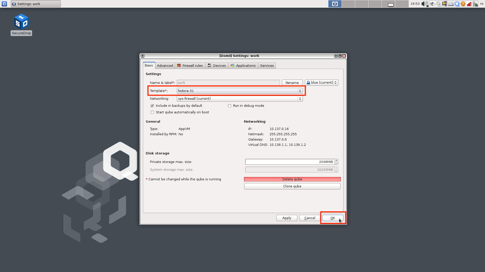

Upgrading to Fedora 31
======================

.. include:: ../includes/top-warning.rst

.. note:: This advisory was written in May 2020, and will be removed when a new version of Qubes that contains the Fedora 31 template is released.

Why do I need to upgrade?
-------------------------

SecureDrop Workstation makes use of the Fedora-based ``work`` and ``vault`` VMs, which are part of a Qubes installation by default. In Qubes 4.0.3, these VMs are based on a Fedora 30 template.

As of June 2020, Fedora 30 templates will be end-of-life. If you are provisioning SecureDrop Workstation for the first time, you will need to update your Fedora template manually from Fedora 31 *before* installing SecureDrop Workstation.

If you are an existing SecureDrop Workstation user, you should also upgrade to a Fedora 31 template.

Install Fedora-31 template
--------------------------

In a ``dom0`` terminal (**Qubes Application Menu > Terminal Emulator**), type the following to download the Fedora 31 template:

.. code:: sh

   sudo qubes-dom0-update qubes-template-fedora-31

You will see some information from the package manager, including a progress bar.

When the download has concluded, you will be prompted to install the package. Type ``y`` to proceed with the installation.

Update the Fedora-31 template
-----------------------------

Once the template is installed, update it using the Qubes updater (**System Tools > Qubes Update**).

Configure VMs to use the new template
-------------------------------------

VMs not managed by SecureDrop Workstation must be manually configured in order to use the Fedora 31 template.

It is most important to update the ``work`` and ``vault`` VMs to Fedora 31; however, you may also choose to update ``sys-net``, ``sys-usb``, and ``sys-firewall``.

To update a VM's base template, find the VM in the Qubes Application Menu and click **Qube settings**. Click the drop-down menu beside **Template:** and select ``fedora-31`` from the list, then click **OK.** Note that, if the VM is running, the change will only take effect once it has been shut down and rebooted.

|screenshot_qsettings_fedora31|

Getting Support
---------------

.. include:: ../includes/getting_support.rst
