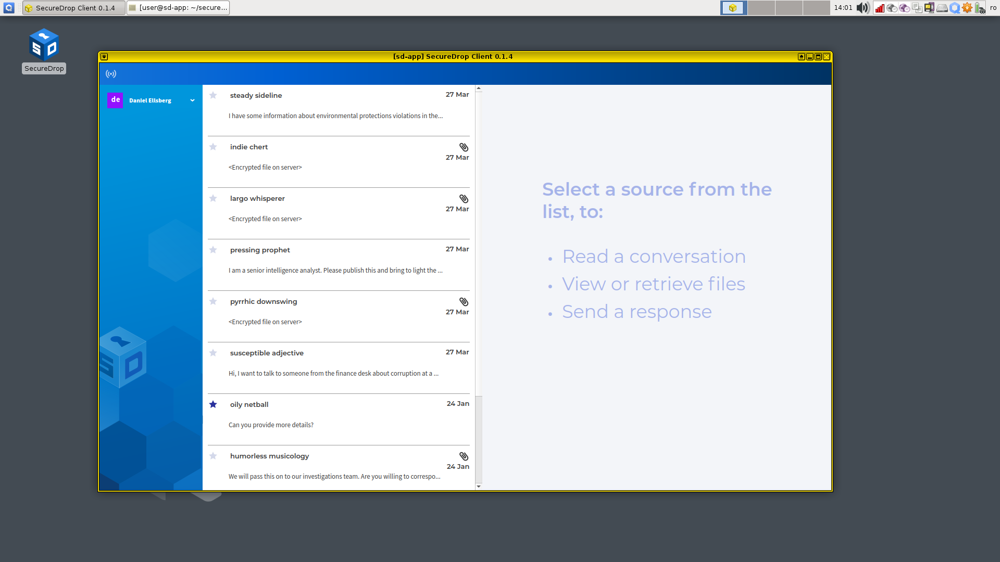
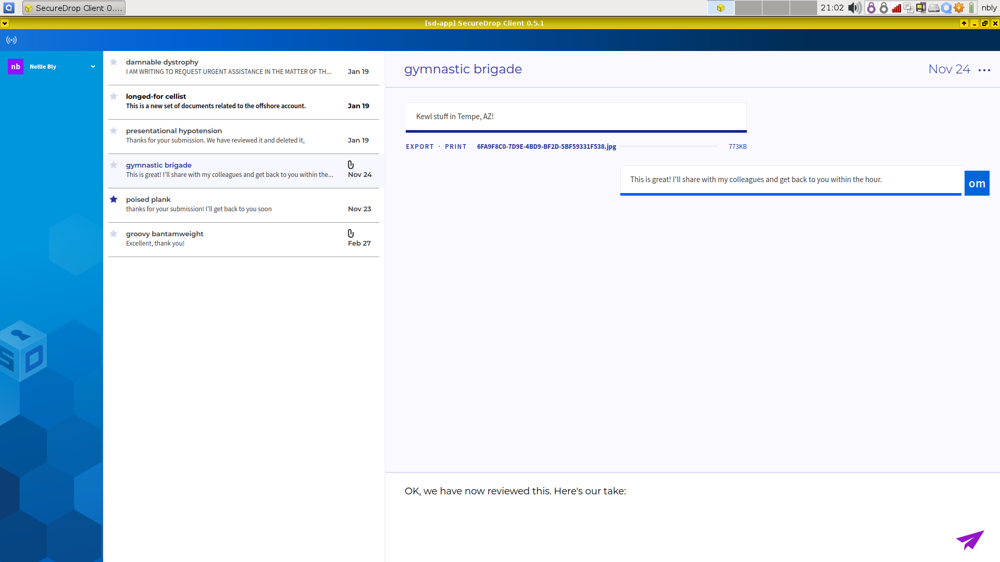

Communicating with sources
==========================

.. include:: ../includes/top-warning.rst

SecureDrop Workstation lets journalists check SecureDrop, decrypt and securely
view submissions, and reply to sources, all on the same computer.

Once logged in, you will see a chat-like user interface consisting of three panels. The small panel on the left shows your username, if you are logged in, or the sign-in button.

|screenshot_sdapp_main_view|

The source list in the middle panel shows sources that have submitted to your instance. Each source is identified to you with a two word
pseudonym.

In the righthand panel, the conversation view allows you to see your
conversation history with a particular source.

Opening a conversation
----------------------

Clicking on a source will display their messages to you in the conversation
view. Replies that you or anyone from your organization has sent will also
appear in the conversation flow.

.. note:: When you are prompted by a dialog that says “Do you allow VM
   'sd-app' to access your GPG keys (now and for the following 28800
   seconds)?”, click **Yes**. This allows the SecureDrop Application VM access
   to the secure VM that holds your SecureDrop Submission Key.

Highlighting conversations
--------------------------

You can highlight important conversations by clicking on the star beside a
source's name. Starred sources will be visible as starred to everyone in your
organization.

Sending a reply
---------------

Compose a reply to the selected source in the text box at the bottom of the
conversation view. Click the paper airplane icon or press "Ctrl+Enter" to send
a reply. Any replies you did not send will be discarded when you exit the
client.

|screenshot_send_reply|

Sources without reply keys
~~~~~~~~~~~~~~~~~~~~~~~~~~
You may sometimes see the text "Awaiting encryption key from server" in a grayed
out reply box for a source. This typically happens when a source has just 
contacted your SecureDrop, and the server has not created an encryption key yet.
If you are logged in, the key will be automatically fetched as soon as it 
becomes available. At that point, the reply box will become available.

Deleting a conversation
-----------------------

You can delete a source conversation by clicking on the three dots at the top
righthand side of the application window, beside the timestamp, and clicking
"Delete source account".

.. important:: Deleting a source conversation deletes the conversation for
   everyone at your organization, and also prevents the source from logging in
   again using their current codename.

