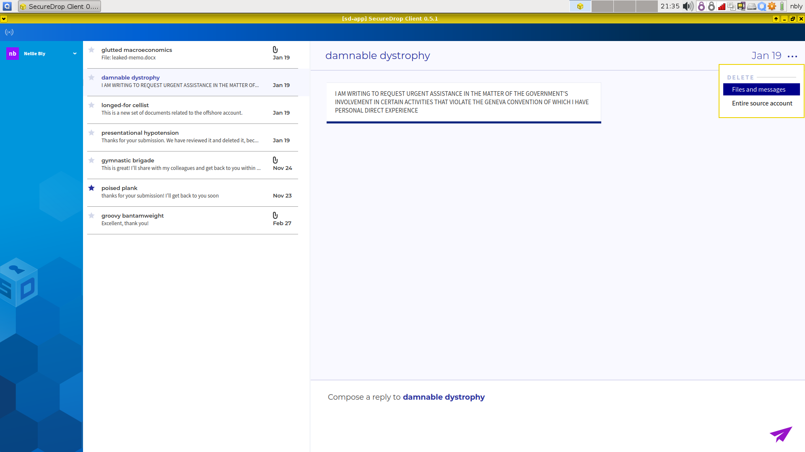

Communicating with sources
==========================

.. include:: ../includes/top-warning.rst

SecureDrop Workstation lets journalists check SecureDrop, decrypt and securely
view submissions, and reply to sources, all on the same computer.

Once logged in, you will see a chat-like user interface consisting of three panels:

- The leftmost panel shows your username, if you are logged in, or the
  sign-in button.

- The middle panel holds the list of sources that have submitted to your
  instance. Each source is identified to you with a two word pseudonym.

- The rightmost panel holds the conversation view. All parts of the conversation
  with a specific source (messages, files, and journalist replies) will be
  displayed here.

Opening a conversation
----------------------

To display a conversation in the conversation view, simply click a source in the
source list.

|screenshot_sdapp_main_view|

Journalists sending replies are assigned different colors and identified with
their initials. Move your mouse pointer over the initials to reveal the full
name.

.. note:: When you are prompted by a dialog that says “Do you allow VM
   'sd-app' to access your GPG keys (now and for the following 28800
   seconds)?”, click **Yes**. This allows the SecureDrop Application VM access
   to the secure VM that holds your SecureDrop Submission Key.

Highlighting conversations
--------------------------

You can highlight important conversations by clicking on the star beside a
source's name. Starred sources will be visible as starred to everyone in your
organization.

Sending a reply
---------------

Compose a reply to the selected source in the text box at the bottom of the
conversation view. Click the paper airplane icon or press "Ctrl+Enter" to send
a reply. Any replies you did not send will be discarded when you exit the
client.

|screenshot_send_reply|

Sources without reply keys
~~~~~~~~~~~~~~~~~~~~~~~~~~
You may sometimes see the text "Awaiting encryption key from server" in a grayed
out reply box for a source. This typically happens when a source has just
contacted your SecureDrop, and the server has not created an encryption key yet.
If you are logged in, the key will be automatically fetched as soon as it
becomes available. At that point, the reply box will become available.

Deleting a conversation
-----------------------

You can delete a source conversation by clicking on the three dots at the top
righthand side of the application window, beside the timestamp. You should
see a dropdown menu with two options: **Files and messages** and **Entire source
account**.

|screenshot_deletion_dropdown|

Click **Files and messages** to delete all files and messages (including journalist
replies) associated with this source, while keeping the source account active.
The source will continue to appear in the source list, and will be able to
communicate with you through the Source Interface.

Click **Entire source account** to also remove the source from the source list,
and to prevent them from logging into the Source Interface. Their account will
be completely removed from the system.

.. |screenshot_sdapp_main_view| image:: ../images/screenshot_sdapp_main_view.png
  :width: 100%
.. |screenshot_send_reply| image:: ../images/screenshot_send_reply.png
  :width: 100%

