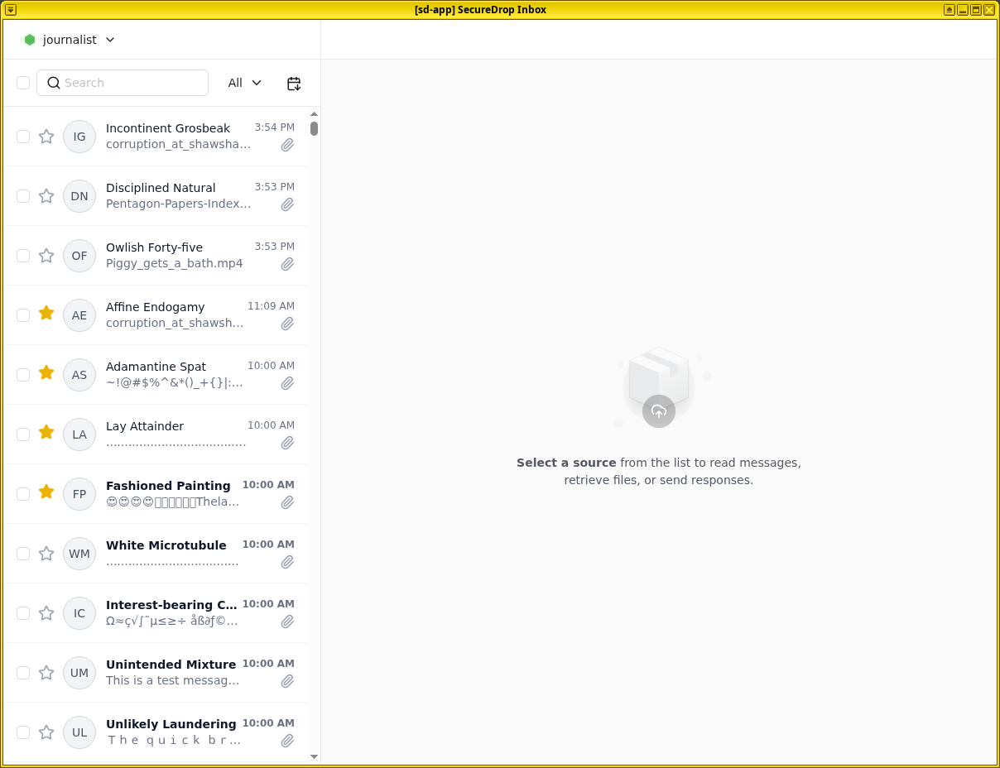
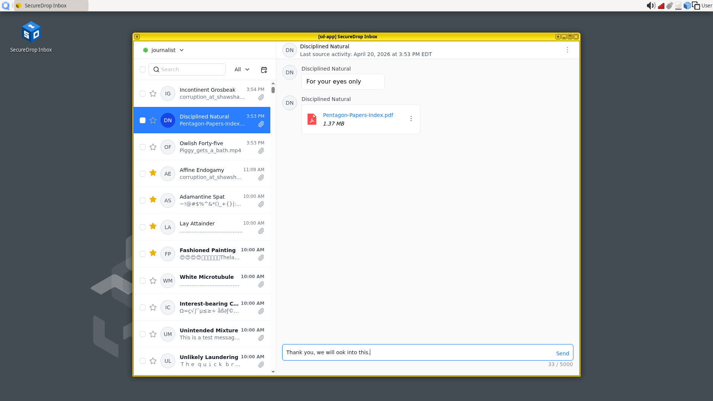
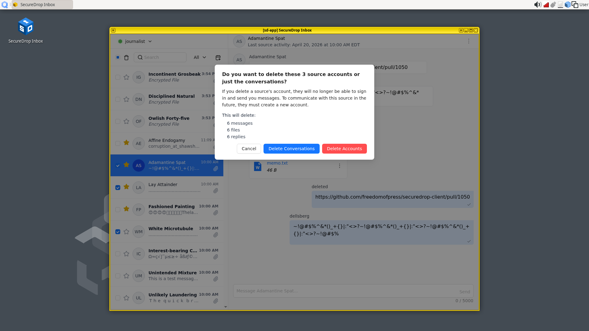
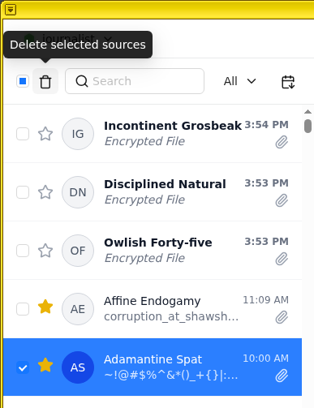

Communicating with sources
==========================

Once signed in to your  SecureDrop Inbox, you will see a chat-like user interface:
  
- The action area of the left panel provides the ability to search submissions, highlight sources, select multiple sources, delete sources and conversations, toggle sort order, and filter the source list. 

- The larger portion of the left panel holds the list of sources that have submitted to your
  instance. Each source is identified to you with a two word pseudonym. You will also
  see the date of the last source activity, an icon to indicate if a source conversation contains any submitted files, and a button to mark a source as starred.

- The right panel holds the conversation view. All parts of the conversation
  with a specific source (messages, files, and journalist replies) will be
  displayed here.

Seen and unseen submissions
---------------------------

Sources with submissions (messages or files) that have not been seen by
any journalist user will be displayed in bold text in the source list.

As soon as any journalist user clicks on a source with unseen submissions, it
will be marked as seen (no longer displayed in bold text) for all users.

Opening a conversation
----------------------

To display the conversation with a source in the conversation view, simply click a source in the source list.

|screenshot_sdapp_main_view|

Replies from other journalists in your organization show up in the conversation, and are identified by the journalist's name.

Highlighting sources
--------------------

You can highlight important sources by clicking on the star beside a
source's name. Starred sources will be visible as starred to everyone in your
organization.

Sending a reply
---------------

Compose a reply to the selected source in the text box at the bottom of the
conversation view. Click the **Send** button or press :kbd:`Ctrl+Enter` to send
a reply.

|screenshot_send_reply|

Your reply will be accompanied by a small clock icon pending the next sync with the server. Once the reply has successfully sent, this will change to a small checkmark.

Deleting source conversations or accounts
-----------------------------------------

You can delete a single source conversation or account by checking the box beside the source name in the list, then clicking the delete button (as indicated by a trash icon) in the action area at the top.

|screenshot_delete_sources_select|

You will be presented with a pop-up where you will be asked to confirm if you would prefer to **Delete Conversation** or **Delete Account**.

|screenshot_confirm_delete|

Click **Delete Conversation** to delete all files and messages (including journalist
replies) associated with this source, while keeping the source account active.
The source will continue to appear in the source list, and will be able to
communicate with you through the Source Interface.

Click **Delete Account** to also remove the source from the source list,
and to prevent them from logging into the Source Interface. Their account will
be completely removed from the system.

Deleting multiple conversations or accounts
'''''''''''''''''''''''''''''''''''''''''''

To delete multiple source conversations or accounts, select more than one source from the list, then click the delete button. You will be
presented with the same options to **Delete Conversations** and
**Delete Accounts** as you would with a single source conversation.

Searching and filtering
-----------------------

The search bar lets you search through all sources based on pseudonym or conversation content (include filenames of already downloaded submissions). This will not search for text *inside* document submissions. 

|screenshot_search|

To filter the list of conversations, use the dropdown menu to the right of the search bar. You can filter the conversation list to show only unread or starred conversations. 

|screenshot_filter|

The list of conversations can be sorted newest-to-oldest or oldest-to-newest. Change the sort order by clicking the sort toggle to the right of the filter dropdown.

|screenshot_sort_toggle|

.. |screenshot_search| image:: /images/screenshot_search.png
.. |screenshot_filter| image:: /images/screenshot_filter.png
.. |screenshot_sort_toggle| image:: /images/screenshot_sort_toggle.png
