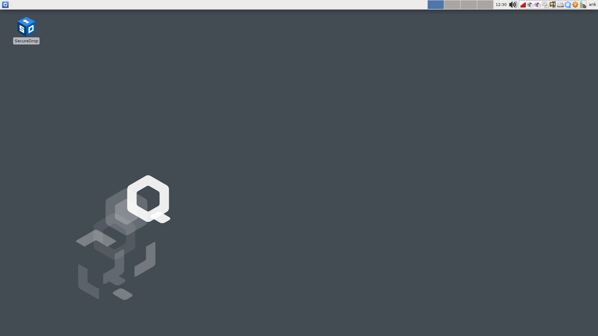
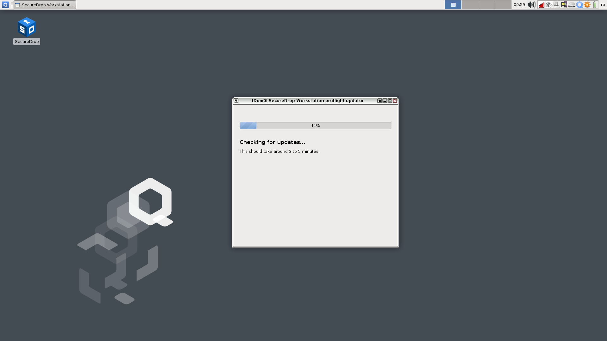
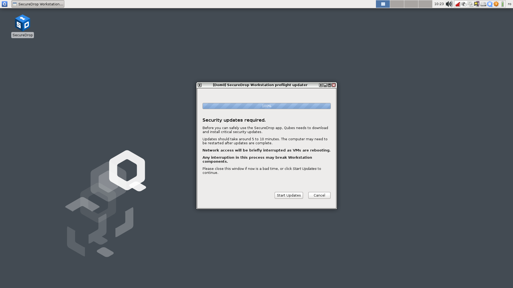
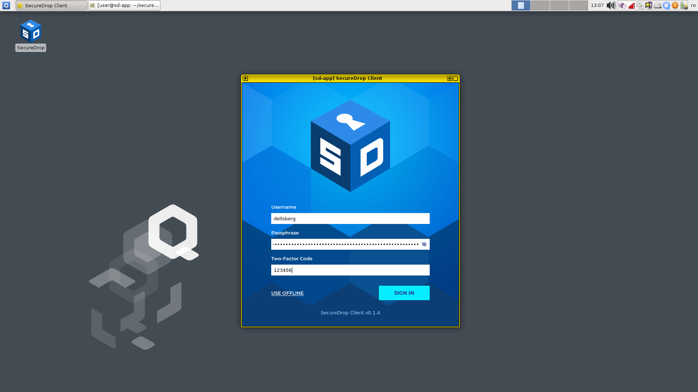
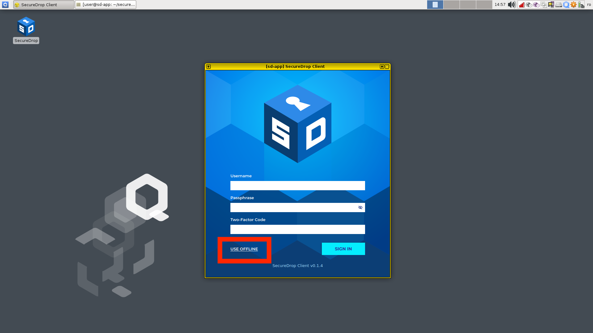
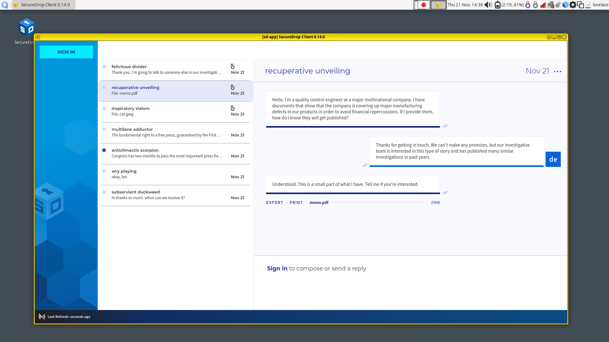

Starting the SecureDrop Client
==============================

.. include:: ../includes/top-warning.rst

After you log into Qubes, the SecureDrop Client app will start automatically. If
you have previously exited the application, you can double-click on the
**SecureDrop** desktop shortcut to launch it.

|screenshot_desktop-shortcut|

Performing updates
------------------

When you launch the application, it will first check for security
updates. This typically takes a few minutes.

|screenshot_check_updates|

If updates are found, you will be asked to apply them before launching the
SecureDrop Client. For security reasons, you will not be able to launch the
SecureDrop Client unless updates have been applied. If you prefer to shut down
the machine or do other work in Qubes OS instead, you can cancel the update.

|screenshot_apply_updates|

.. important:: When you click "Apply Updates," allow the update
   process to complete fully, without closing or interrupting it, or you risk
   breaking important system components. The update process can take from just
   a few minutes to 30 minutes or longer, depending on your network connection
   and how many updates are available.

Once the update process has been completed, the SecureDrop Client will launch.

Signing in
----------

To sign in, enter the username and passphrase provided to you by your
SecureDrop administrator, as well as the two-factor code using the method you
have set up. If you have used SecureDrop before, these
are the same credentials that you would use to log in to the Journalist
Interface.

|screenshot_sd-app_login|

After signing in, you will be prompted by a dialog that says “Do you allow VM
‘sd-app’ to access your GPG keys (now and for the following 8 hours)?”.
Click **Yes.** This dialogue may appear immediately after signing in, or when
you click on a source submission.

|screenshot_gpg_access|

Troubleshooting tips
~~~~~~~~~~~~~~~~~~~~
If you have trouble running the updater or logging in, please contact your
administrator. Our :doc:`network troubleshooting guide <../admin/troubleshooting_connection>`
for administrators gives detailed steps for investigating connectivity issues.

Working offline
---------------

Offline mode is available for circumstances where you wish to work offline or
are unable to connect to the SecureDrop servers. In offline mode, any content
that you have previously downloaded will be available. You will not be able to
send or delete messages.

|screenshot_use_offline|

Because SecureDrop Workstation allows you to download and decrypt submissions
on one machine, submissions that you have downloaded are still available in
offline mode and can be accessed even when you are not logged in.

|screenshot_offline_mode|

.. important:: Protecting downloaded submissions is another reason why
   SecureDrop Workstation needs to be powered off completely when it is not in
   use.

.. |screenshot_gpg_access| image:: ../images/screenshot_gpg_access.png

