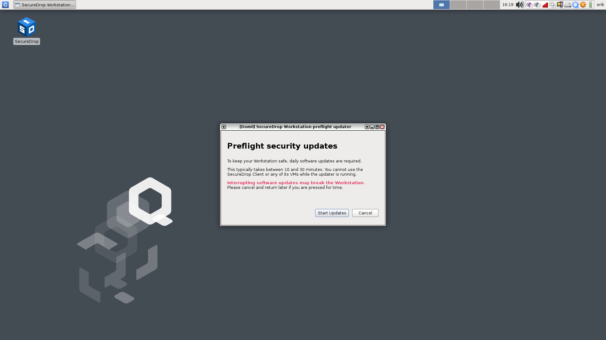

Starting the SecureDrop App
==============================

After you log into Qubes, the SecureDrop App will start automatically. If
you have previously exited the application, you can double-click on the
**SecureDrop** desktop shortcut to launch it.

|screenshot_desktop-shortcut|

Performing updates
------------------

Unless the system has just been updated, SecureDrop Workstation will now prompt
you to automatically download and apply any available security updates:

|screenshot_update_prompt|

For security reasons, you will not be able to launch the SecureDrop App until
updates have been applied. This typically takes between 10 and 30 minutes.

Click "Start updates" if you are ready to start the process. (If you prefer to
shut down the machine or do other work in Qubes OS instead, click "Cancel".)
You will see a progress indicator until updates are completed:

|screenshot_apply_updates|

.. important:: Allow the update process to complete fully, without closing or
   interrupting it, or you risk breaking important system components.

At the end of this process, SecureDrop Workstation may prompt you to reboot
if core system components were updated. Once all steps in the update process have
been completed, the SecureDrop App will launch automatically.

Signing in
----------

To sign in, enter the username and passphrase provided to you by your
SecureDrop administrator, as well as the two-factor code using the method you
have set up. If you have used SecureDrop before, these
are the same credentials that you would use to log in to the Journalist
Interface.

|screenshot_sd-app_login|

Troubleshooting tips
~~~~~~~~~~~~~~~~~~~~
If you have trouble running the updater or logging in, please contact your
administrator. Our :doc:`network troubleshooting guide 
<../admin/reference/troubleshooting_connection>`
for administrators gives detailed steps for investigating connectivity issues.

Seen and unseen submissions
---------------------------

Sources with submissions (messages or files) that have not been seen by
any journalist user will be displayed in bold text in the source list.

As soon as any journalist user clicks on a source with unseen submissions, it
will be marked as seen (no longer displayed in bold text) for all users.

Working offline
---------------

Offline mode is available for circumstances where you wish to work offline or
are unable to connect to the SecureDrop servers. In offline mode, any content
that you have previously downloaded will be available. You will not be able to
send or delete messages, and your actions will not impact the seen/unseen
state of submissions.

|screenshot_use_offline|

Because SecureDrop Workstation allows you to download and decrypt submissions
on one machine, submissions that you have downloaded are still available in
offline mode and can be accessed even when you are not logged in.

|screenshot_offline_mode|

.. important:: Protecting downloaded submissions is another reason why
   SecureDrop Workstation needs to be powered off completely when it is not in
   use.

.. |screenshot_desktop-shortcut| image:: ../images/screenshot_desktop-shortcut.png
  :width: 100%

.. |screenshot_apply_updates| image:: ../images/screenshot_apply_updates.png
  :width: 100%
.. |screenshot_sd-app_login| image:: ../images/screenshot_sd-app_login.png
  :width: 100%
.. |screenshot_use_offline| image:: ../images/screenshot_use_offline.png
  :width: 100%
.. |screenshot_offline_mode| image:: ../images/screenshot_offline_mode.png
  :width: 100%
