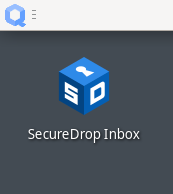
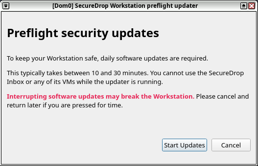
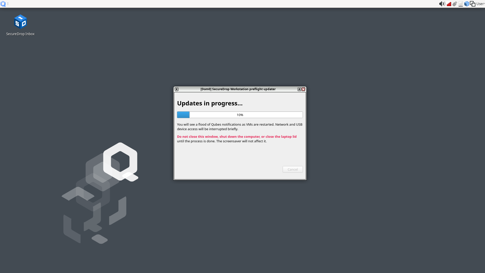
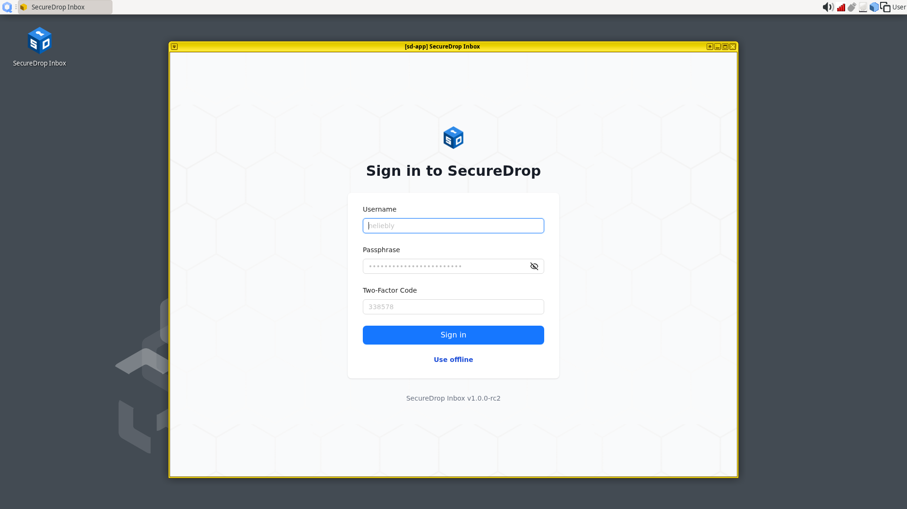
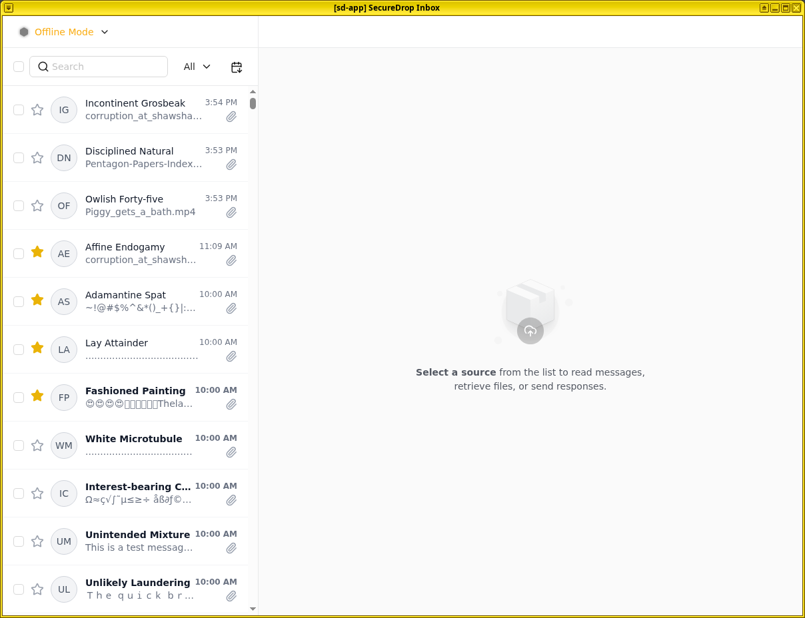

Starting SecureDrop Inbox
==============================

After you log into Qubes, SecureDrop Inbox will start automatically. If
you have previously exited the application, you can double-click on the
**SecureDrop Inbox** shortcut in the top left of the desktop to launch it.

|screenshot_desktop-shortcut|

Performing updates
------------------

Unless the system has just been updated, you will now be prompted to automatically download and apply any available security updates:

|screenshot_update_prompt|

For security reasons, you will not be able to launch the SecureDrop Inbox until
updates have been applied. This typically takes between 10 and 30 minutes.

Click "Start updates" if you are ready to start the process. (If you prefer to
shut down the machine or do other work in Qubes OS instead, click "Cancel".)
You will see a progress indicator until updates are completed:

|screenshot_apply_updates|

.. important:: Allow the update process to complete fully, without closing or
   interrupting it, or you risk breaking important system components.

At the end of this process, SecureDrop Workstation may prompt you to reboot
if core system components were updated. Once all steps in the update process have
been completed, the SecureDrop Inbox will launch automatically.

Signing in
----------

To sign in, enter the username and passphrase provided to you by your
SecureDrop administrator, as well as the two-factor code using the method you
have set up. If you have used SecureDrop before, these
are the same credentials that you would use to sign in to the Journalist
Interface.

|screenshot_sd-app_login|

Troubleshooting tips
~~~~~~~~~~~~~~~~~~~~
If you have trouble running the updater or logging in, please contact your
administrator. Our :doc:`network troubleshooting guide 
<../admin/reference/troubleshooting_connection>`
for administrators gives detailed steps for investigating connectivity issues.

Menu
----

Once signed in, the top of the left panel shows your username. Clicking your username shows the menu, which lets you initiate a sync with your SecureDrop server, view help information, sign out, or quit SecureDrop Inbox.

|screenshot_menu|

Syncing
-------

Unless you are in :ref:`offline mode<Offline mode>`, SecureDrop Inbox will automatically sync with your SecureDrop Instance every 60 seconds, or every time you send a reply. Syncing also fetches new submissions sent by sources or replies from other journalists in your organization. You can initiate a sync manually from the menu or by typing :kbd:`Ctrl+S`.

The sync indicator will be green if the last sync was successful. 

|screenshot_sync_indicator|

If the sync indicator is orange, it means the most recent sync failed or did not complete properly. If your SecureDrop Inbox is repeatedly unable to sync, you can try :doc:`troubleshooting the network connection</admin/reference/troubleshooting_connection>` on your SecureDrop Workstation or contacting your admin for help. 

.. _Offline mode:

Working offline
---------------

Offline mode is available for circumstances where you wish to work offline or
are unable to connect to your SecureDrop server. 

|screenshot_use_offline|

Because SecureDrop Workstation allows you to download and decrypt submissions
on one machine, submissions that you have previously downloaded are still available in
offline mode and can be accessed even when you are not signed in.

.. important:: Protecting downloaded submissions is another reason why
   SecureDrop Workstation needs to be powered off completely when it is not in
   use.

Any actions you take while in offline mode, such as sending replies or deleting conversations, will be synchronized to the server the next time you sign in. To sign in while in offline mode, click the orange "Offline Mode" to open the menu and select "Sign in".

|screenshot_offline_mode_menu|

.. |screenshot_menu| image:: /images/screenshot_menu.png
.. |screenshot_sync_indicator| image:: /images/screenshot_sync_indicator.png
.. |screenshot_use_offline| image:: ../images/screenshot_use_offline.png
  :width: 100%

.. |screenshot_offline_mode_menu| image:: /images/screenshot_offline_mode_menu.png
.. |qubes_menu| image:: /images/qubes_menu.png
  :alt: Qubes Application menu
.. |qubes_menu_gear| image:: /images/qubes_menu_gear.png
  :alt: System Tools 
