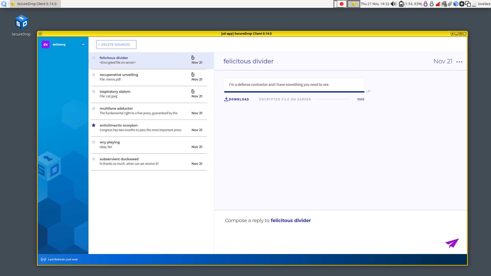
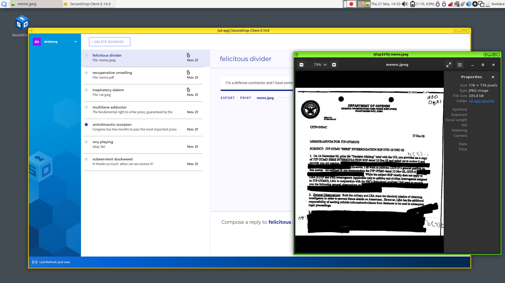
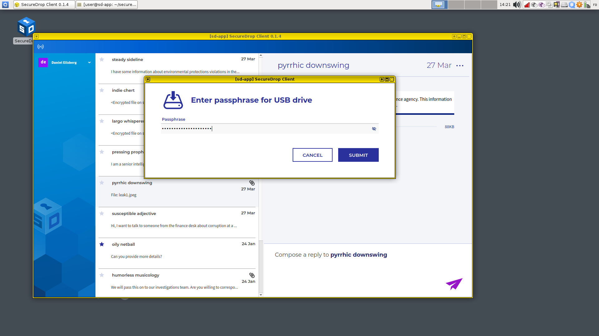

Working with submissions
========================

When a source submits files, you will see a Download button in the conversation
flow, a file size, and light-gray text that says "Encrypted file on server."

|screenshot_file_before_download|

Downloading
-----------

To download a file, click the **Download** button. An animated spinner will
indicate that the file is downloading:

|screenshot_file_downloading|

Once the file has been downloaded and decrypted, the filename will be visible,
as will the action **Export** and **Print**. The displayed file size may increase
after the download is complete, because the SecureDrop Client automatically
decompresses the downloaded file.

|screenshot_file_download_successful|

Viewing
-------

To view a downloaded submission, click its filename. This will open
the file in a temporary environment, called a "disposable VM." The file you
clicked on will open in a new window with a different colored border and a
window title prefixed with "disp" (meaning disposable).

|screenshot_dispvm|

This disposable VM is a special isolated environment similar to the *Secure
Viewing Station*; it does not have internet access, and isolates the files that
you are viewing from other sensitive files and applications on the same
computer.

.. tip:: In Qubes, window border colors are used to signify different virtual
   machines.

.. _`the Qubes OS documentation`: https://www.qubes-os.org

Printing
--------

To print a document, a :doc:`compatible printer <../admin/reference/hardware>`  must be plugged into the computer's USB port.

1. Click "Print" button and wait for ``sd-devices`` VM to start.
2. You will prompted to attach your printer.
3. A Print Document dialog will appear, from which you can configure different print options before printing the document.

Exporting to an Export USB
--------------------------

Currently, a LUKS- or VeraCrypt-encrypted USB drive is required for exporting submissions.

1. Insert the USB drive and wait for the ``sd-devices`` VM to start.
2. If your drive is using VeraCrypt, you will need to unlock it manually:

   1. Open the file menu by clicking on the Qubes Application menu |qubes_menu| (in the top left),
      select **sd-devices** and click **Files**.
   2. In the left sidebar, there should be an entry labeled **# GB Possibly Encrypted**,
      click it.
      |screenshot_veracrypt_sd_devices_files|
   3. You will be prompted for the password configured for this USB drive:

      - Volume type: leave both unchecked
      - PIM: leave empty
      - Password: drive's password
      - Forget password immediately: selected

      |screenshot_veracrypt_sd_devices_files_unlock|
   4. Click **Connect**.

3. Back in your source's conversation, click **Export**.
   |screenshot_export_dialog|
4. If you have not already unlocked your USB drive, you will be prompted for the
   password configured for this USB drive.
   |screenshot_export_drive_passphrase|

5. Once you see a message informing you that the export was successfully completed,
   you can safely unplug the USB drive. Alternatively, you can leave the drive
   plugged in and export additional files.

.. |screenshot_file_download_successful| image:: ../images/screenshot_file_download_successful.png
  :width: 100%

.. |screenshot_export_dialog| image:: ../images/screenshot_export_dialog.png
  :width: 100%

.. |screenshot_veracrypt_sd_devices_files| image:: ../images/screenshot_veracrypt_sd_devices_files.png
  :width: 100%
.. |screenshot_veracrypt_sd_devices_files_unlock| image:: ../images/screenshot_veracrypt_sd_devices_files_unlock.png
  :width: 100%
.. |qubes_menu| image:: ../images/qubes_menu.png