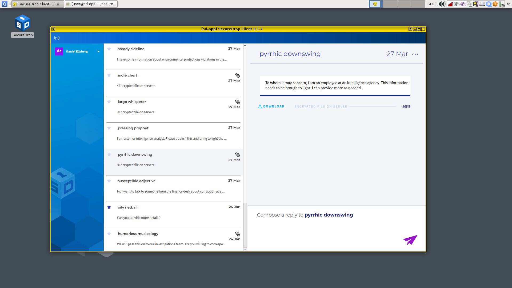

Working with submissions
========================

.. include:: ../includes/top-warning.rst

When a source submits files, you will see a Download button in the conversation
flow, a file size, and light-gray text that says "Encrypted file on server."

|screenshot_file_before_download|

Downloading
-----------

To download a file, click the **Download** button.

|screenshot_download_button|

An animated spinner will indicate that the file is downloading:

|screenshot_file_downloading|

Once the file has been downloaded and decrypted, the filename will be visible,
as will the action **Export** and **Print**. The displayed file size may increase
after the download is complete, because the SecureDrop Client automatically
decompresses the downloaded file.

|screenshot_file_download_successful|

Viewing
-------

To view a downloaded submission, click its filename. This will open
the file in a temporary environment, called a "disposable VM." The file you
clicked on will open in a new window with a different colored border and a
window title prefixed with "disp" (meaning disposable).

|screenshot_dispvm|

This disposable VM is a special isolated environment similar to the *Secure
Viewing Station*; it does not have internet access, and isolates the files that
you are viewing from other sensitive files and applications on the same
computer.

.. tip:: In Qubes, window border colors are used to signify different virtual
   machines.

.. _`the Qubes OS documentation`: https://www.qubes-os.org

Printing
--------

To print a document, click the **Print** button. Currently, printing is only
supported with select printers from Brother and HP, and for security reasons
you are required not to use a printer that has any wireless capabilities.

You should have access to a supported printer that has been set up by your
administrator. The printer must be plugged into the computer's USB port.

Exporting to an Export USB
--------------------------

Currently, a LUKS-encrypted USB drive is required for exporting submissions. A
Linux-based system such as Tails is required to configure and use a LUKS-encrypted
drive, meaning that for the time being, you will only be able to
export to a Linux environment where these drives can be read. For assistance
with this, see your SecureDrop administrator.

Once you have provisioned a LUKS-encrypted export drive, insert the drive and
click **Export**.

|screenshot_export_dialog|

You will be prompted for the password configured for this
USB drive.

|screenshot_export_drive_passphrase|

Once you see a message informing you that the export was successfully completed,
you can safely unplug the USB drive. Alternatively, you can leave the drive
plugged in and export additional files.

.. |screenshot_file_before_download| image:: ../images/screenshot_file_before_download.png

.. |screenshot_file_downloading| image:: ../images/screenshot_file_downloading.png
.. |screenshot_file_download_successful| image:: ../images/screenshot_file_download_successful.png
.. |screenshot_dispvm| image:: ../images/screenshot_dispvm.png
.. |screenshot_export_dialog| image:: ../images/screenshot_export_dialog.png
.. |screenshot_export_drive_passphrase| image:: ../images/screenshot_export_drive_passphrase.png
